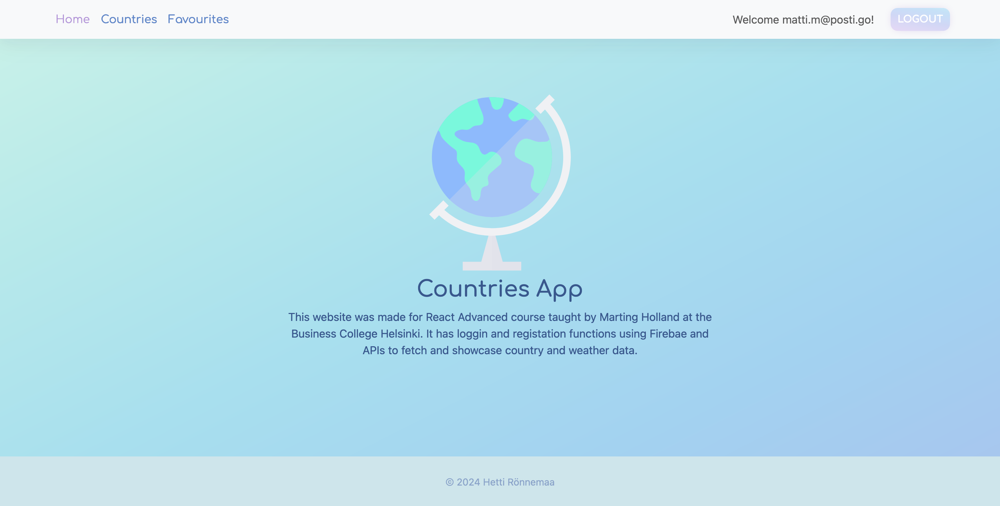

# React + Redux Countries App

A full-stack app for searching countries and showing basic country and weather info fetched from APIs. Has loggin and registation form and functionality to add personal favourite countries.

### [Live Page](https://reactreduxcountries.netlify.app/)

## Functionality

- Authentication: user's login information and favourite countries are stored in the database
- Countries page: view all countries and their basic information, filter countries with search
- Favourites: View favourited countries, add or remove countries from favourites
- Single country page: view full flag and current weather

## Technologies used

- Language: Javascript
- Front-end: React with Vite
- Back-end: Firebase
- State management: Redux, Redux Toolkit
- Styling: Bootstrap, React Icons
- APIs: Rest Countries, Firebase Firestore, Open Weather

## Credits

This project was part of the React Advanced course taught by [Martin Holland](https://github.com/martin-holland) at Business College Helsinki.

Vector icons seeing in the site were edited from [svgrepo](https://www.svgrepo.com/)

## Setup

- Clone the project: `git clone https://github.com/hetti-r/Redux-Countries.git`
- Install dependencies `npm install`
- Add your own Firebase and OpenWeather API key to the .env file
- Run `npm run dev`
